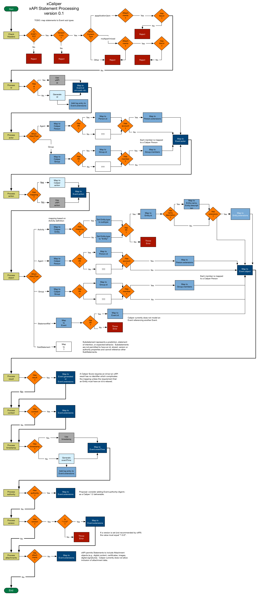

## xCaliper - An Overview for Aligning Caliper and xAPI 

### Chris Vento and Anthony Whyte

### Background
Caliper Analytics&#174; is an IMS specification developed by IMS member organizations (universities and suppliers, now numbering 430).  Caliper defines an information model, learning domain-specific controlled vocabularies, and a common data interchange format for describing, collecting and exchanging learning activity data between systems.  Caliper governance, development activities, and asset curation practices are determined by IMS member organizations operating in partnership with IMS staff within a "pay to play" consortial environment.

The Experience API (xAPI) is a specification developed by ADL and a number of suppliers that "facilitates the documentation and communication of learning experiences." \[[xAPI spec, part 1](https://github.com/adlnet/xAPI-Spec/blob/master/xAPI-About.md#partone)\].  xAPI is a data transport specification that provides a standard messaging format and rules governing the processing, storage and retrieval of xAPI statements over HTTP.  Unlike Caliper, the xAPI spec does not provide domain-specific controlled vocabularies for describing learning interactions.  Rather it leaves it to the marketplace to define how learning experiences are to be described.  ADL has encouraged xAPI adopters to form "Communities of Practice" (CoP) in order to develop learning domain-specific controlled vocabularies.  Currently, twelve CoPs are listed in ADL's [index](https://www.adlnet.gov/adl-research/performance-tracking-analysis/experience-api/xapi-community-of-practice-cop/).  However, no central authority oversees CoP governance or curation of xAPI verbs, recipes and profiles produced by COPs or other entities. 

A 2016 IMS [comparison](https://www.imsglobal.org/initial-xapicaliper-comparison) of Caliper and xAPI described the two specifications as not equivalent but complementary.  We detect a good deal of overlap between the two specifications.  That said, we believe that Caliper is superior to xAPI both in design, governance, and increasingly, industry support.  We recommend that Caliper/xAPI "convergence" take the form of an xAPI-to-Caliper migration strategy developed by IMS in concert with ADL.  To that end, we recommend adjustments to the Caliper information model to capture certain xAPI concepts and attributes not currently described by the model as well as an xCaliper transducer service for converting xAPI statements to Caliper Events as an aid to migration. 

### Assertions

* Caliper provides an event-based, extensible information model, composed of profiles that define learning domain-specific concepts, relationships and rules.  The model is optimized for describing and collecting learning interactions at a granular level and is augmented by a simple API for transmitting learning data to consuming endpoints.  Unlike xAPI, Caliper is *opinionated* and defines profiles and events that enforce vocabulary agreement between implementers in order to ensure both data and semantic interoperability between systems.  As a result learning activity data sourced from a variety of providers can more easily be consumed, understood, blended and analyzed.  In contrast, xAPI's over-reliance on borrowed W3C Activity Streams 1.0 concepts has saddled the specification with imprecise and confusing terms and definitions. 

* Caliper is not dependent on other IMS specifications. Nevertheless it benefits from opportunities to align with sibling specifications such as Learning Tools Interoperability (LTI) and OneRoster.  xAPI neither enforces vocabulary agreement between adopters nor benefits from the synergies implicit in the IMS ecosystem. 

* Caliper governance and curation practices backed by the IMS community provide a more internally consistent and sustainable development ecoystem than ADL's de-centralized, CoP approach to xAPI profile development and curation.

* ADL has produced a [Companion Spec for xAPI Vocabularies](https://adl.gitbooks.io/companion-specification-for-xapi-vocabularies/content/) and recently an [xAPI Profiles specification](https://github.com/adlnet/xapi-profiles) in partnership with the [Data Interoperability Standards Consortium](http://datainteroperability.org/research-activity-xapi-data-interoperability/xapi-profiles/).  Rustici offers an xAPI [Registry](https://registry.tincanapi.com/) under its "Tin Can API" brand that provides listings of xAPI verbs, recipes and profiles.  The ADL-sponsored companion specifications are admirable additions but in no way solve the fundamental interoperability concerns regarding vocabulary agreement and use.

* xAPI is a transport specification limited to HTTP request/response messaging.  Caliper is messaging protocol neutral (although it should be noted that currently, Caliper's certification suite only accepts test messages over HTTP).  Caliper encourages implementers to utilize whatever transport protocol aligns with their business needs and industry best practice.  UT Austin, for example, is implementing Caliper using [MQTT](http://mqtt.org/), a lightweight publish/subscribe messaging protocol optimised for IOT.

* Caliper's data interchange format is more refined and easier to query than xAPI's statement format, with the added benefit of utilizing the JSON-LD syntax for serializing Linked Data.  Unlike Caliper Events, xAPI statements are not typed, forcing implementers to construct more complicated queries to retrieve data.  xAPI statement design forces frequent overuse of `context.extensions` in order to capture contextual information otherwise modeled by Caliper.  Interoperability is undercut as a result.  xAPI's use of language maps also complicates querying and adds unnecessary statement bloat.

* xAPI adoption is largely the result of its "first-mover" status that we believe Caliper can overcome.  ADL released xAPI version 1.0 in April 2013, some 30 months prior to the release of Caliper 1.0 (October 2015).  Since its release, Caliper has made significant strides in market adoption among the most important sources of learning data: LMS providers.  Blackboard, D2L, Instructure, and Moodle are all leading the way with Caliper adoption.  The situation is the same with major educational content providers such as Elsevier, Kaltura, McGraw Hill Education, and VitalSource.  This success has been achieved with the active support of major universities such as the University of California, Berkeley, the University of Michigan and the Unizin Consortium.  

* The modest adoption traction that xAPI has so far gained in the .edu space, particularly in Europe, we regard as temporary.  Corporate trainers' embrace of xAPI may prove more difficult to dislodge given xAPI's connection to the SCORM ecosystem and the route it provides to escape the limitations imposed by the CMI data model and ADL SCORM runtime.  xAPI's edge in data store / Learning Record Store (LRS) options we also regard as temporary.  But all market sectors should be encouraged to transition to Caliper via advocacy and migration service offerings.

* The majority of xAPI usage focuses on packaging up a wide spectrum of locally-described learning experience data for transmission to a learning record store (LRS).  The Babel-like character of these data streams is inimical both to data sharing, blending and scaling.  The xAPI community has begun to recognize this serious shortcoming in approach.  While xAPI profiles and recipes do exist they often remain "local" in inspiration and usage (e.g., the JISC [recipes](https://github.com/jiscdev/xapi)).  Other efforts such as the MedBiquitous [profiles and recipes](http://groups.medbiq.org/medbiq/display/XIG/Profile%2C+Recipes+and+working+documents) and [vocabulary](http://xapi.vocab.pub/datasets/medbiq/) look more like draft works-in-progress than published artifacts.  Both AICC's [cmi5](https://github.com/AICC/CMI-5_Spec_Current) and ADL's [SCORM](https://github.com/adlnet/xAPI-SCORM-Profile/blob/master/xapi-scorm-profile.md) profiles are both robust efforts intended for general use but with limited applicability to the .edu sector. 
Nevertheless, the profiles and recipes provide a useful mechanism for mapping xAPI statements to Caliper events.

* If Caliper is regarded as a superset of xAPI, then efforts should be made to map xAPI profiles, recipes and Statements (both unstructured and those linked to profiles and recipes) to Caliper Profiles and Events.  Caliper includes a Basic Profile that allows implementers to compose generic events referencing any Caliper `Action` or `Entity` described by the model.  The profile provides a built-in extension mechanism for implementers who need to compose events that have yet to be modeled in other described profiles.  Unstructured xAPI statements can be mapped to the Basic Profile with minor rule adjustments.  Opting for the inverse and positioning Caliper as a subset of xAPI would result in a substantial loss in fidelity when expressing/serializing a Caliper Event as an xAPI Statement.

### What is xCaliper?  
Conceptually, xCaliper repositions xAPI as a subset of Caliper.  xAPI terms would be mapped to Caliper and provisions made to incorporate new terms should they arise.  xCaliper is also envisioned as a transducer service that converts or *caliperizes* inbound xAPI data streams prior to forwarding transformed messages to a target endpoint.  Conversely, xCaliper could also be used to transform or *caliperize* outbound xAPI statements emitted from an LRS.  xCaliper could also operate on Caliper data streams as a validation service.  If warranted, xCaliper could be envisioned as a general *caliperization* service, perhaps with a plugin architecture so that learning activities generated in conformance with other specifications (e.g., W3C ActivityStreams) can also be transformed.


Migrating from one model to another takes time.  Existing xAPI producers can adopt a gradualist migration strategy by leveraging xCaliper, reducing the pressure to rewrite immediately code that collects and serializes learning experience data as xAPI Statements.  xAPI producers might also be encouraged to provide hints to xCaliper via xAPI Statement `context.extensions` in order to simplify conversion of Statements to particular Caliper events.  Likewise, Caliper endpoint providers can harness xCaliper in order to interoperate with xAPI-enabled applications without the need to implement an xAPI consumer service.

If xAPI terms, profiles, and recipes could be mapped and then deprecated in favor of associated Caliper profiles then both the IMS and the xAPI communities can join together to work collectively on expanding metric profiles to cover more and more learning activity use case scenarios. 

### Expected Market Impact for xCaliper
Minimally, xCaliper is intended to simplify the consumption of learning interaction data sourced from a mixed set of producers generating data streams adhering to two different specifications.  xCaliper is also intended to encourage migration to Caliper, albeit gradually, by performing the heavy lifting of mapping xAPI terms to Caliper terms and converting xAPI Statements to Caliper Events.  Not least, xCaliper provides a path for the two communities to synchronize efforts focused on improving the description, collection,  transmission, storage and use of learning activity data.  The overarching goal is to help create the conditions for an orderly transition to a common information model and set of domain-specific controlled vocabularies governed and curated by members of the IMS Community.

During the initial cycle of xCaliper service implementation, we expect that the xAPI and Caliper communities will continue to work largely independent of one another.  If xCaliper is established as an open source effort, opportunities may develop to include xAPI contributors in the project.  Once xCaliper reaches MVP status we should have a viable market solution that dovetails with the increasing number of analytics implementations that we anticipate may need to support, at least in short to medium term, both Caliper and xAPI.  How the respective IMS and xAPI development workgroups and communities will begin to work together needs to be addressed in order to establish a more formalized and structured collaborative work group effort.

### The xCaliper Technical Solution
xCaliper will provide a conversion service designed to transform xAPI statements into Caliper events.  Caliper events will also be accepted and either routed directly to a target endpoint or validated before transmission elsewhere. Converted xAPI statements will be expressed as JSON-LD. Caliper terms will supercede xAPI terms whenever exact match and near match mappings exist. In certain cases, xAPI Activity types and verbs will be retained in order to preserve Statement semantics across the conversion. This may result in statement-to-event conversions that extend existing Caliper controlled vocabularies.

Mapping xAPI vocabularies to Caliper terms will require the establishment and maintenance of data dictionaries or mapping files.  Defining and publishing mappings between terms (perhaps using the SKOS vocabulary [mapping properties](https://www.w3.org/TR/skos-reference/#mapping)) should be included in the scope of the proposed IMS "Profiles Registry".  Indeed, we recommend that IMS propose to Rustici that they consider retiring their commercial-backed registry in favor of an IMS-sponsored replacement. 

We should also consider extending the Caliper Event model to include certain xAPI concepts such as Statement Authority, Statement reference (i.e., a pointer to a pre-existing statement), SubStatement (i.e, prediction or statement of intention, or anticipated future action), Statement attachments and perhaps Statement signing.  *Caliperizing* these concepts will help maintain fidelity during the conversion process and reduce the need to unmatched xAPI concepts to `Event.extensions`.

What follows is a preliminary walkthrough of likely xCaliper behavior with respect to xAPI message header and statement property processing with example JSON / JSON-LD.  For a visualization of xAPI Statement processing see [Appendix A](#appendixA) below.     
 
#### Message Header processing
xCaliper will process both PUT (single statement) and POST (single statement, batch statements) HTTP requests.  Message headers will be inspected, in particular `Content-Type` and the custom `X-Experience-API-Version` request headers.  xAPI message requests normally set the `Content-Type` value to "application/json".  Statement requests that include Attachments use the "multipart/mixed" content type.

Regarding `Content-Type` handling xCaliper should consider adopting behaviors that mirror LRS requirements as described in the xAPI Spec, sections [1.5.1](https://github.com/adlnet/xAPI-Spec/blob/master/xAPI-Communication.md#15-content-types) and [1.5.2](https://github.com/adlnet/xAPI-Spec/blob/master/xAPI-Communication.md#152-multipartmixed):

"application/json" document types

* accept PUT or POST requests that include Statement batches containing either no Attachment objects or Attachment objects with a defined fileURL.

"multipart/mixed" document types

* accept PUT or POST requests that include Statement batches containing Attachments in the transmission format described in the xAPI spec.

* reject PUT or POST requests that include Statement batches that include Attachments that lack a defined `fileURL` or fail to match a received Attachment part based on their hash.

* assume a Content-Transfer-Encoding of binary for Attachment parts when receiving a PUT or POST requests.

* reject Statement batches that are larger than xCaliper is configured to allow.

* accept batches of Statements which contain no Attachment Objects when receiving a PUT or POST requests.

* accept batches of Statements which contain only Attachment Objects with a populated `fileUrl` when receiving a PUT or POST requests.

xCaliper will process 1.0.x Statements only.  The service will reject requests without a custom xAPI version header (pre xAPI version 0.95) or with a version header set to a value other than "1.0.0" unless such requests are routed to a fully conformant implementation of the prior version specified in the header (see xAPI Spec [2.4.10](https://github.com/adlnet/xAPI-Spec/blob/master/xAPI-Data.md#2410-version) and [3.3](https://github.com/adlnet/xAPI-Spec/blob/master/xAPI-Communication.md#versioning)).

#### Mapping Event types
Converting an xAPI Statement to a Caliper `Event` subtype such as a `MessageEvent` is not a straightforward operation.  Unlike Caliper, which is explicit in its use of `Event` subtypes for descriptive purposes and as an aid to querying (e.g., `AssessmentEvent`, `MessageEvent` etc.), xAPI Statement "types" are defined optionally by specifying a `context.contextActivities` array consisting of one or more `category` object values.  Each `category` is defined as "an Activity used to categorize the Statement".  The array can be used to link a Statement to a profile such as cmi5 (see cmi5 [9.6.2 contextActivities](https://github.com/AICC/CMI-5_Spec_Current/blob/quartz/cmi5_spec.md#context_activities). 

However, xAPI profiles and recipes are neither uniformly consistent in design nor referenced consistently in xAPI staterecipements.  The xAPI spec provides an example of a Statement referencing cmi5 `contextActivities` categories (see xAPI Spec [Appendix B: cmi5](https://github.com/adlnet/xAPI-Spec/blob/master/xAPI-About.md#appendix-b-cmi5-example).  xCaliper should be able to leverage this information when attempting to map a Statement to a Caliper `Event` type.  On the other hand, the JISC recipes do not utilize `context.contextActivities` to link its xAPI Statements to a particular recipe choosing instead to provide a generic recipe reference in `context.extensions` (see JISC [logged in example](https://github.com/jiscdev/xapi/blob/master/vle/blackboard/loggedin.json).  These sorts of Statement variations may prove challenging when attempting to poll xAPI profiles and recipes for hints.

In cases where an xAPI Statement resists conversion to a Caliper `Event` subtype, xCaliper will convert the Statement to a generic `Event`.  That said, there are other ways to map an xAPI Statement to a Caliper `Event` subtype.  Certain Statement `verb` choices such as "annotated", "logged-in" or "logged-out" should prove sufficient to map a Statement to a `AnnotationEvent` or a `SessionEvent`.  Statement "types" can also be inferred from the Activity Object Definition (see xAPI Spec [2.4.4.1](https://github.com/adlnet/xAPI-Spec/blob/master/xAPI-Data.md#activity-definition).  If an xAPI `object` is typed as an `Activity` it may include an optional activity `definition` object property that provides additional metadata regarding the activity including a recommended `type` IRI.  If a `definition.type` value is provided xCaliper could use it to map the Statement to a Caliper `Event` type.  

```
{
  "object": {
    "id": "http://moodle.data.alpha.jisc.ac.uk/course/view.php?id=4",
    "definition": {
      "type": "http://adlnet.gov/expapi/activities/assessment",
      . . .
    },
    "objectType": "Activity"
  }
}
```
to

```
{
  "@context": "http://purl.imsglobal.org/ctx/caliper/v1p1",
  "id": "urn:uuid:27734504-068d-4596-861c-2315be33a2a2",
  "type": "AssessmentEvent",
  . . .
  "object": {
    "id": "http://moodle.data.alpha.jisc.ac.uk/course/view.php?id=4",
    "type": "Assessment"
    . . .
  }
}
```

Other mappings may require more complex associations involving Statement `verb`, the `object`, and other property combinations.  For instance, if a Statement includes a `result` in combination with a `verb` with a value of "completed", "earned", "failed", "graded", "passed" or "scored" xCaliper could infer that the Statement is scoring related and map it to a Caliper `GradeEvent`.  xCaliper may well need to employ a duck typing strategy to map these sort of associations.

#### Statement `id` processing
xAPI Statement providers are not required to provide a UUID identifier (the LRS must set it if not provided).  If a UUID is provided xCaliper will map it to `Event.id` as a URN using the form `urn:uuid:<UUID>`.  If the Statement is not provisioned with a UUID xCaliper will generate and assign a UUID , perhaps with a reference to UUID assignment in a changeLog object in `Event.extensions.` 

```
{
  "id": "urn:uuid:1b557176-ba67-4624-b060-6bee670a3d8e",
  "type": "Event",
  . . .
  "extensions": {
    "changeLog": {
      "dateConverted": "2017-11-18T11:59:59.000Z",
      "idAssignedBy": "xCaliper | Provider"
    }
  }
}
```

#### Statement `actor` processing
An xAPI Statement `actor` can be an `Agent` or a `Group` (a collection of type `Agent`).  xCaliper will map the xAPI Statement `actor` to the Caliper `Event.actor` typed as a Caliper `Person` or `Group`.

```
{
  "actor": {
    "mbox": "mailto:example.learner@example.com",
    "name": "Example Learner",
    "objectType": "Agent"
  }
}
```

to

```
{
  "actor": {
    "id": "mailto:example.learner@example.com",
    "type": "Person",
    "name": "Example Learner"
  }
}
```

Each xAPI `Agent` includes a required "inverse functional identifier" comprising either an mbox mailto IRI (email address), hex-encoded SHA1 hash of a mbox mailto IRI, OpenId or an account object that represents a user account on an existing system such as an LMS.  Given that an xAPI `Agent` can be assigned a non-IRI identifier we will need to establish a conversion rule for xCaliper when such identifiers are encountered.  For example, an xAPI `account.name` object can be assigned an otherwise opaque value representing a unique login id or name.

```
{
  "actor": {
    "account": {
      "homePage": "http://www.example.com",
      "name": "1625378"
    },
    "objectType": "Agent"
  }
}
```

```
{
  "actor": {
    "id": "???",
    "type": "Person",
    "extensions": {
      "xapi": {
        "account": {
          "homePage": "http://www.example.com",
          "name": "1625378"
        }
      }
    }
  }
}
``` 

#### Statement `verb` processing
The absence of firm xAPI governance and curation practices means that anyone can mint a verb for use in an xAPI statement.  That said, Rustici has made an attempt to provide the xAPI community with a registry of xAPI verbs.  Most of the "Tincan" verbs are drawn from the W3C Activity Streams 1.0 specification, a verb set much reduced in size in the re-scoped Activity Streams 2.0 release.  ADL's set of xAPI verbs are also included.  Rustici has itself contributed a robust set of verbs to the registry.  A small set of additional verbs are drawn from a variety of commercial providers including Brindleway, HT2 Labs (Curatr), RISC and Andrew Downes among others.  Not all verbs in the Rustici registry focus on learning (e.g., "laughed", "purchased", "ran", "walked"). 

| &nbsp; | Caliper | ADL xAPI | Rustici xAPI | Activity Streams 2.0 | Activity Streams 1.0 | Others |
| :----: | :------: | :------: | :----------: | :------------------: | :------------------: | :---: |
| Total  | 64 | 30 | 46 | 28 | 88 | 19 |

Where equivalencies exist between the various verb vocabularies xCaliper can simply map the term to the appropriate action, as the following example illustrates:

```
{
  "verb": {
    "id": "https://w3id.org/xapi/adl/verbs/logged-in",
    "display": {
      "en-US": "logged in"
    }
  }
}
```

```
{
  "action": "LoggedIn"
}
```

As the Caliper information model evolves the number of defined actions will increase, enhancing xCaliper's ability to substitute Caliper actions for xAPI verbs.  For instance, the draft Caliper Digital Badges profile slated for Caliper 1.2 adds a dozen new actions.  However, there are many xAPI verb object representations that have no ready equivalent in Caliper.  Consider ADL's list of 30 xAPI verbs.  As of today, we can map 13 ADL verbs (43.33%) to Caliper actions.  Of the 13 verbs we can achieve an exact match on 8 (26.66%) and a near match on 5 (16.66%), such as converting ADL's "updated" to Caliper's "modified".  In such cases, xAPI verb IRIs will be need to be assigned as values: 

```
{
  "verb": {
    "id": "http://adlnet.gov/expapi/verbs/attended",
    "display": {
      "en-US": "attended"
    }
  }
}
```

```
{
  "action": "http://adlnet.gov/expapi/verbs/attended"
}
```  

#### Statement `object` processing
Likewise, various xAPI vocabularies define Activity types for use when the object of a Statement is an "Activity" rather than an `Agent`, `Group`, `Substatement` or `Statement Reference`.  Despite the confusing nomenclature an xAPI `Activity` is equivalent to a Caliper `Entity`.  Each xAPI Activity type is provisioned with a required `id` of type IRI and optional `objectType` (type = string of value "Activity") and `definition` object.  The `definition` or "Activity Definition Object" provides additional recommended and optional metadata about the Activity (see xAPI spec [2.4.4.1](https://github.com/adlnet/xAPI-Spec/blob/master/xAPI-Data.md#2441-when-the-objecttype-is-activity)).

The Rustici TinCan registry defines 110 Activity Types drawn principally from Rustici, W3C Activity Streams 1.0, and ADL.  A small set of additional verbs are drawn from a variety of commercial providers including Brindleway, HT2 Labs (Curatr), RISC and Andrew Downes among others.  In addition, W3C Activity Streams 2.0 defines 8 Core types, 5 Actor types, 12 Object types, and 1 Link Type.

| &nbsp; | Caliper | ADL xAPI | Rustici xAPI | Activity Streams 2.0 | Activity Streams 1.0 | Others |
| :----- | :------:| :------: | :----------: | :------------------: | :------------------: | :----: |
| Total  | 44 | 16 | 58 | 26 | 28 | 8 |

Not all the Activity Types listed in the Rustici Tincan registry describe learning-related objects (e.g., "sales opportunity", "security role", "changed diaper").

Whenever the xAPI Statement `object.objectType` = "Activity", xCaliper would convert the xAPI Statement `object` to a Caliper `Entity`.  As of Caliper 1.1 we can map a minimum 48 xAPI Activity Types (43.63%) listed in the Rustici Tincan Registry directly to Caliper Entity subtypes.  ADL describes fourteen Activity Types. Eight of these types (57.14%) can be mapped to available Caliper entities.  The remaining six Activity Types (42.85%) could either be mapped to the generic `Entity` or retain the original type and provide an inline JSON-LD context as described below.

If type equivalency can be established, xCaliper would convert the xAPI Activity type to an `Entity` subtype.  xCaliper would also attempt to convert Activity `definition` object properties to Caliper `Entity` properties (e.g., `name` to `name`). xAPI properties that resist mapping to an existing Caliper property would be added to `Entity.extensions`.

```		  
{
  "object": {
    "id": "https://www.example.com/assessments/5",
    "definition": {
      "name": {
        "en-US": "Assessment no. 5"
      },
      "type": "http://adlnet.gov/expapi/activities/assessment"
    },
    "objectType": "Activity"
  }
}
```

to

```
{
  "object": {
    "id": "https://www.example.com/assessments/5",
    "type": "Assessment",
    "name": "Assessment no. 5"
  }
}
```	

If no Caliper type exists that matches an xAPI Activity type xCaliper could retain the original type by defining for it an inline `@context` as part of the conversion process.
	
```
{
  "object": {
    "id": "https://www.example.com/simulations/1",
    "definition": {
      "name": {
        "en-US": "Simulation no. 1"
      },
      "type": "http://adlnet.gov/expapi/activities/simulation"
    },
    "objectType": "Activity"
  }
}
```

to

```
{
  "object": {
    "@context": {
      "adl": "http://adlnet.gov/expapi/activities/",
      "simulation": "adl:simulation"
    },
    "id": "https://www.example.com/simulations/1",
    "type": "simulation",
    "name": "Simulation no. 1"
  }
}
```

Otherwise, xCaliper could convert the unmatched xAPI Activity Type as a generic `Entity` and record the Activity Object Type in `Entity.extensions`.


```
{
  "object": {
    "id": "https://www.example.com/meetings/27",
    "definition": {
      "name": {
        "en-US": "xCaliper Meeting"
      },
      "type": "http://adlnet.gov/expapi/activities/meeting"
    },
    "objectType": "Activity"
  }
}
```

to

```
{
  "object": {
    "id": "https://www.example.com/meetings/27",
    "type": "Entity",
    "name": "xCaliper Meeting",
    "extensions": {
      "xapi": {
        "object": {
          "definition": {
            "type": "http://adlnet.gov/expapi/activities/meeting"
          }
        }
      }
    }
  }
}
```

If the xAPI Statement `object.objectType` = "Agent" or "Group", xCaliper would map the xAPI Statement `object` to a Caliper `Person`, `Group` as described above for converting the Statement `actor`. 

If the xAPI Statement `object.objectType` = "StatementRef" xCaliper can either map the xAPI Statement `object` to a generic Caliper `Event` or retain the xAPI type and provide an inline `@context` based on Jason Haag's draft [xAPI ontology](https://github.com/arwhyte/xapi-ontology/blob/master/ontology.rdf).  Note that an xAPI `StatementRef` object is provisioned with an `id` and `type` only.  If xCaliper were to convert a `StatementRef` to a generic Caliper `Event` certain required properties (i.e., `actor`, `action`, `object`, `endTime`) could not be set⎯a violation of the current Caliper model.

```
{
  "object": {
    "objectType": "StatementRef",
    "id": "8f87ccde-bb56-4c2e-ab83-44982ef22df0"
  }
}
```
to

```
{
  "object": {
    "id": "urn:uuid:8f87ccde-bb56-4c2e-ab83-44982ef22df0",
    "type": "Event"
  }
}
```

or

```
{
  "object": {
    "@context": {
      "xapi": "https://w3id.org/xapi/ontology#",
      "StatementRef": "xapi:StatementRef"
    },
    "id": "urn:uuid:8f87ccde-bb56-4c2e-ab83-44982ef22df0",
    "type": "StatementRef"
  }
}
```

Similarly, if the `object.objectType` = "SubStatement" xCaliper can either map the xAPI Statement `object` to a generic Caliper `Event` or retain the xAPI type and provide an inline `@context` with a term drawn from Jason Haag's draft [xAPI ontology](https://github.com/arwhyte/xapi-ontology/blob/master/ontology.rdf).  The xAPI `SubStatement` should include values for all required Caliper `Event` properties. 

#### Statement `result` processing
Unlike Caliper, xAPI provides its Statement with a top-level `result` property.  This sort of privileging is understandable given xAPI's SCORM antecedent and roots in corporate training where compliance is a key goal.  The xAPI `Result` object is little more than a property bag without an `id` or a `type` specified which creates conversion challenges.  Despite Caliper modeling both a `Score` and a `Result` xCaliper may need to retain the xAPI `result` object as is and define an inline `@context` for it from terms drawn from Jason Haag's draft [xAPI ontology](https://github.com/arwhyte/xapi-ontology/blob/master/ontology.rdf).  The object could be recorded in `Event.generated` or `Event.extensions` if the former is deemed inappropriate since the object would not be typed as an `Entity`.

```
{
  "result": {
    "score": {
      "scaled": 0.95
    },
    "success": true,
    "completion": true,
    "duration": "PT1234S"
  }
}
```

to

```
{
  "generated": {
    "@context": {
      "xapi": "https://w3id.org/xapi/ontology#",
      "result": "xapi:Result",
      "score": "xapi:Score",
      "completion": "xapi:completion",
      "duration": "xapi:duration",
      "scaled": "xapi:scaled",
      "success": "xapi:success"
    },
    "result": {
      "score": {
        "scaled": 0.95
      },
      "success": true,
      "completion": true,
      "duration": "PT1234S"
    }
  }
}
```

#### Statement `context` processing

The xAPI Statement `context` property attempts to capture portions of the learning context in which a Statement is situated.  All xAPI `context` properties are considered optional.  xCaliper will copy the `context` as is to `Event.extensions` if provided.  Certain property values could be extracted from the Statement `context` and mapped to various Caliper `Event` properties as is noted below.  

| xAPI | Type | Description |
| :--- | :--- | :------------ |
| `context.registration` | UUID | The registration identifier of a Context object.  Copy to `Event.extensions` |
| `context.instructor` | Agent or Group | Copy to `Event.extensions.xapi.context`.  Assuming `Event.group` is a course the `instructor` could also be added to the `CourseOffering`/`CourseSection` `extensions` property. |
| `context.team` | Group | Copy to `Event.extensions`.  The `team` value could also be mapped to `Event.membership.organization` (although xAPI does not appear to model an individual member's role or status). |
| `context.contextActivities` | ContextActivities Object | Copy to `Event.extensions`.  Four context types are defined: "parent", "grouping", "category" and "other", each expressed as an array of values.  If a parent Activity is described and can be converted to a Caliper `DigitalResource` or `Organization` then map the parent to the Caliper `isPartOf` or `subOrganizationOf` property.  If a category Activity is described that links to an xAPI profile or recipe xCaliper may be able to map the Statement to a particular `Event` type based on the reference. |
| `context.revision` | string | `Event.extensions`.  If the Statement `object` is an Activity that can be mapped to a Caliper `DigitalResource` the `revision` value can also be mapped to `DigitalResource.version`. |
| `context.platform` | string | Copy to `Event.extensions`.  Unfortunately since there is no xAPI requirement that the `platform` value be expressed as an IRI there is no way to convert the value to a Caliper `SoftwareApplication` and map it to `Event.edApp`. |
| `context.language` | string | RFC 5646 language code.  Copy to `Event.extensions`. |
| `context.statement` | Statement Reference | Another Statement considered as context for this Statement. Copy to `Event.extensions`. |
| `context.extensions` | Object | A map of other domain-specific context relevant to the Statement.  Copy to `Event.extensions`. |

```
{
  "extensions": {
    "xapi": {
      "context": {
        "registration": "UUID",
        "instructor": {},
        "team": {},
        "contextActivities": {},
        "revision": "",
        "platform": "",
        "language": "",
        "statement": "",
        "extensions": {}
      }
    }
  }
}
```
	
#### Statement `timestamp` processing
xAPI Statement providers are not required to provide a timestamp (the LRS must set it if not provided).  If a timestamp is provided xCaliper will map it to `Event.eventTime` as an ISO 8601 formatted date time string value.  If the Statement is not provisioned with a timestamp xCaliper will generate and assign an `eventTime`, perhaps with a reference to the date time assignment in a changeLog object in `Event.extensions.` 

```
{
  "id": "urn:uuid:1b557176-ba67-4624-b060-6bee670a3d8e",
  "type": "Event",
  . . .
  "eventTime": "2017-11-18T11:59:59.000Z",
  "extensions": {
    "changeLog": {
      "dateConverted": "2017-11-18T11:59:59.000Z",
      "eventTimeAssignedBy": "xCaliper | Provider"
    }
  }
}
```
	
#### Statement `stored` processing
The xAPI Statement `stored` timestamp property is set by the LRS upon receipt of the Statement.  xCaliper will not provide a `stored` date time value in `Event.extensions`.

#### Statement `authority` processing
The xAPI Statement `authority` object property provides a reference to an Agent or a Group representing a 3-legged OAuth asserting the veracity of the Statement (see xAPI Spec [2.4.9](https://github.com/adlnet/xAPI-Spec/blob/master/xAPI-Data.md#249-authority).  Although listed as optional an `authority` must be set by the LRS if not provided or if a strong trust relationship between the Statement Provider and LRS has not been established.  In the case of a 3-legged OAuth, the `authority` is a `Group` composed of two Agents.  The `Agent` that represents the OAuth consumer must be identified by an `account` while the second `Agent` represents the user. 
	
If xCaliper encounters a Statement `authority` the object will be mapped to `Event.extensions`.  If no `authority` object value is provided xCaliper will ignore the property.

```
{
  "authority": {
    "objectType": "Group",
    "member": [{
        "account": {
          "homePage": "http://example.com/xAPI/OAuth/Token",
          "name": "oauth_consumer_x75db"
        }
      },
      {
        "mbox": "mailto:bob@example.com"
      }
    ]
  }
}
```		
	
to

\[TODO: represent `authority` with an inline context or convert to a Caliper `Agent` or `Group`? \]

```
{
  "extensions": {
    "xapi": {
      "authority": {
         . . .
      }
    }
  }
}	
```	
	
#### Statement `version` processing
The xAPI spec does not recommend setting the Statement `version` property since versioning is handled by a custom Header.  If a Statement provider sets the Statement `version` it must set the value to "1.0.0" rather than the latest patch version.

xCaliper will not set the `version` property.  If a Statement provider chooses to set the `version` to "1.0.0" xCaliper will map it to `Event.extensions`.  If xCaliper encounters a Statement with a `version` set to a value other than "1.0.0" it will reject the Statement.

```
{
  "version": "1.0.0"
}
```

to

```
{
  "extensions": {
    "xapi": {
      "version": "1.0.0"
    }
  }
}
```
	
#### Statement `attachments` processing

\[TODO: describe \]

<a name="appendixA" />

### Appendix A.  xCaliper Statement Processing Diagram

